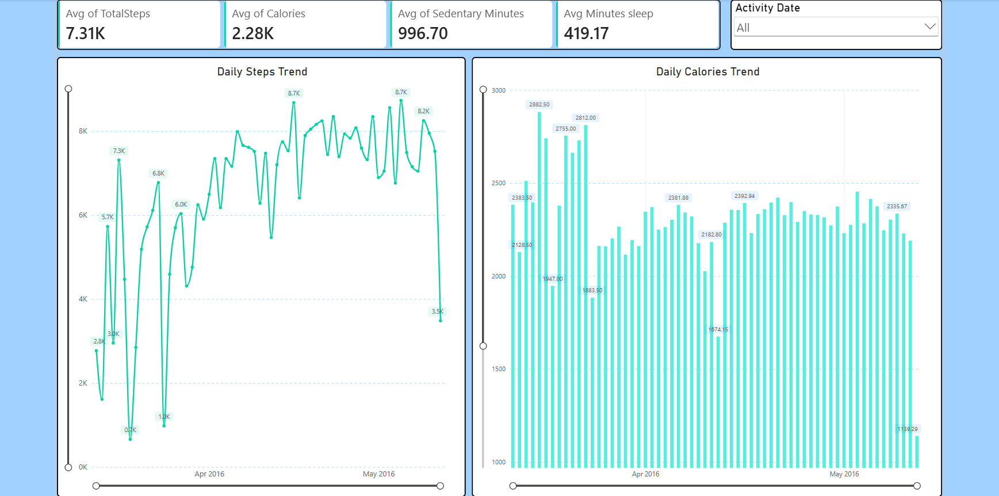
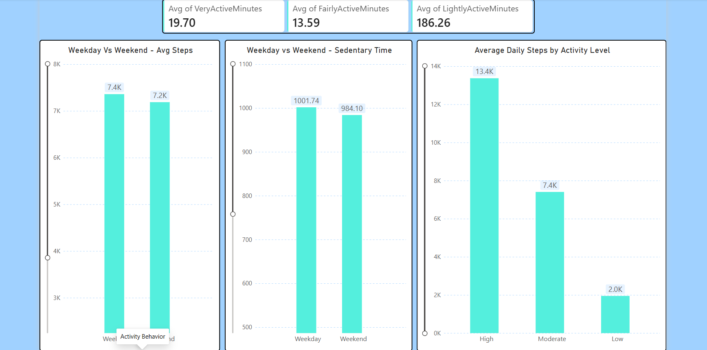
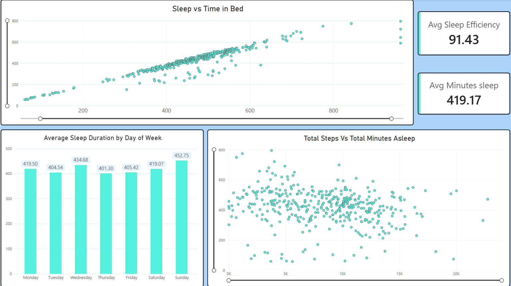

# Bellabeat Data Analytics Case Study

## Project Overview

This project analyzes smart-device usage data to identify user activity, sleep, and wellness patterns and generate business recommendations for Bellabeat, a company focused on health and wellness products.

The analysis follows a complete data analytics workflow using Excel, Power Query, SQL, and Power BI.

## Business Problem

Bellabeat wants to better understand how consumers use smart wellness devices and identify behavioral patterns that can support marketing and product decisions.

The analysis focuses on understanding:

- How users engage with their devices
- Daily activity and movement patterns
- Sleep behavior
- Relationships between activity and wellness indicators
- Opportunities for Bellabeat to improve user engagement

## Business Objectives

The main objectives of the analysis were to:

1. Analyze daily activity and device usage patterns.
2. Understand user activity levels and behavior.
3. Examine sleep patterns and their relationship with daily activity.
4. Identify meaningful trends in user wellness behavior.
5. Develop data-driven recommendations for Bellabeat's marketing strategy.

## Dataset

The project uses a public smart-device fitness dataset containing Fitbit user activity and wellness information.

The dataset includes information related to:

- Daily activity
- Steps
- Calories
- Distance
- Sleep
- Sedentary time
- Active minutes
- Device usage

The dataset was used for educational and portfolio analysis purposes.

## Tools Used

| Tool | Purpose |
|---|---|
| Excel | Data exploration and initial analysis |
| Power Query | Data cleaning and transformation |
| SQL | Data analysis and querying |
| Power BI | Data visualization and dashboard development |

## Data Preparation

The data preparation process included:

- Reviewing the available datasets
- Checking data structure and column formats
- Identifying missing values
- Removing unnecessary fields
- Standardizing data formats
- Preparing datasets for analysis
- Creating calculated metrics required for the analysis

Power Query was used to transform and prepare the data before conducting the final analysis.

## Analysis Approach

The analysis was conducted across several areas:

### Activity Analysis

Daily steps, distance, active minutes, and calories were examined to understand user activity levels and engagement with fitness devices.

### Sleep Analysis

Sleep duration and sleep behavior were analyzed to understand users' sleeping patterns and their relationship with daily activity.

### Wellness Behavior

Activity and sleep indicators were compared to identify broader behavioral patterns that could be relevant to Bellabeat's health and wellness strategy.

## Key Findings

The analysis identified several important patterns in smart-device usage and user behavior.

- User activity levels varied considerably across individuals.
- Daily steps and activity levels provided useful indicators of overall engagement.
- A significant portion of daily time was associated with sedentary behavior.
- Sleep duration varied among users and provided an additional indicator of wellness behavior.
- Combining activity and sleep information provided a broader understanding of user lifestyle patterns.

## Recommendations

Based on the analysis, Bellabeat can consider the following strategies:

1. **Encourage daily activity**

   Bellabeat can use personalized reminders and activity goals to encourage users to maintain consistent daily movement.

2. **Promote healthier sleep habits**

   Sleep tracking insights can be incorporated into user-facing features and campaigns to encourage better sleep routines.

3. **Use personalized engagement**

   User activity patterns can be used to create personalized notifications, goals, challenges, and recommendations.

4. **Increase engagement with wellness features**

   Bellabeat can combine activity, sleep, and wellness information to provide users with a more complete picture of their daily health behavior.

5. **Use behavioral insights in marketing**

   The identified usage patterns can support targeted marketing campaigns focused on fitness, wellness, activity, and healthy lifestyle habits.

## Power BI Dashboard

The final Power BI dashboard was created to present the major findings in an interactive and easy-to-understand format.

### Dashboard Overview



### Activity Analysis



### Sleep & Wellness Analysis



## Project Files

- **Power BI Dashboard:** Interactive Power BI dashboard containing the final visual analysis.
- **SQL Analysis:** SQL queries used to analyze the dataset.
- **Project Report:** Detailed documentation of the Bellabeat case study.
- **Dashboard Images:** Screenshots of the Power BI dashboard.

## Project Structure

```text
bellabeat-data-analytics-case-study/
│
├── images/
│   ├── dashboard-overview.png
│   ├── activity-analysis.png
│   └── sleep-analysis.png
│
├── Bellabeat case study dashboard.pbix
├── bellabeat_analysis.sql
├── Project - Bellabeat_Data_Analytics_Case_Study.pdf
└── README.md
